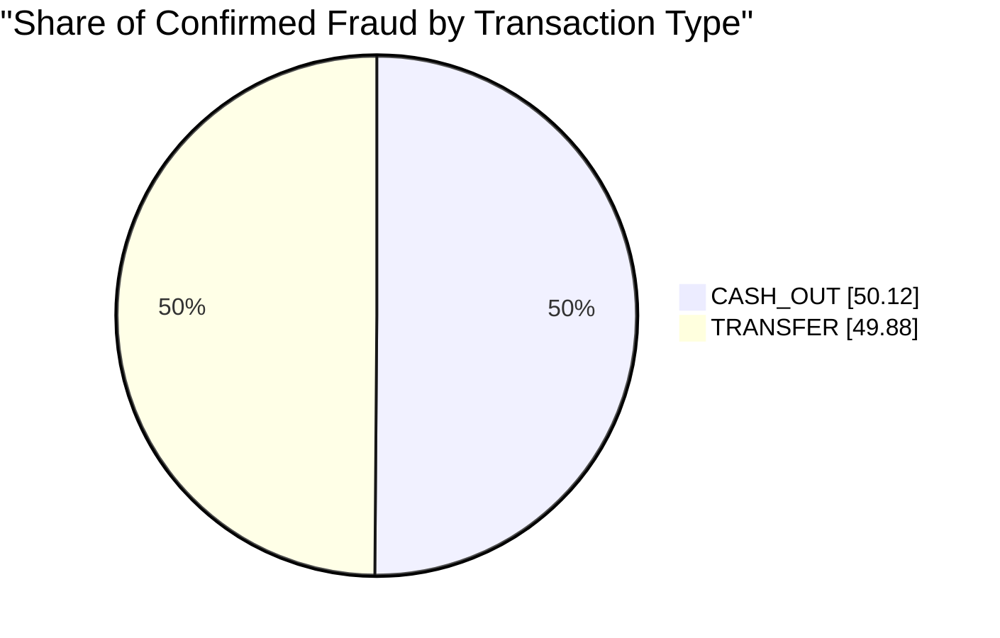
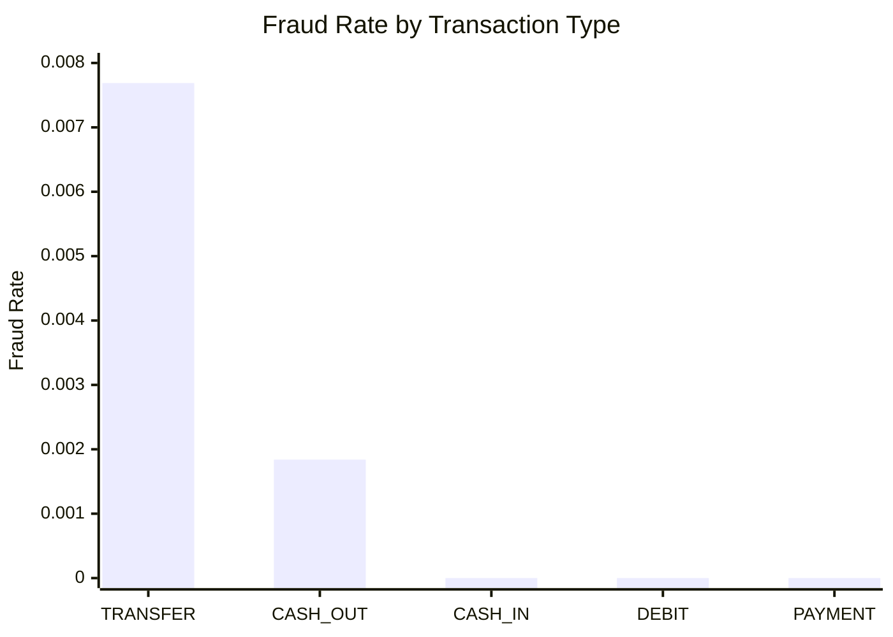
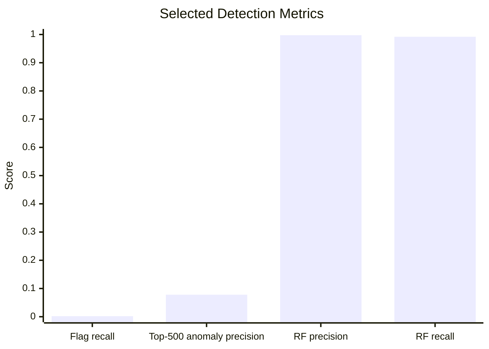

# Fraud Risk Monitoring & Detection on PaySim

Goal. Analyze a large-scale synthetic mobile-money transaction dataset, identify where fraud risk is concentrated, and build a staged fraud workflow that moves from data validation to monitoring, anomaly ranking, and supervised detection.

Stack. Python (`pandas`, `numpy`, `scikit-learn`, `matplotlib`, `pyarrow`) + Jupyter notebooks.

* * *

## Executive Summary (TL;DR)

- Dataset: `6,362,620` transactions with `8,213` confirmed fraud rows (`0.129%` fraud rate).
- Data quality: saved audit outputs show no missing values and no duplicate rows.
- Core finding: fraud is concentrated almost entirely in `TRANSFER` and `CASH_OUT`.
- Built-in flag: `isFlaggedFraud` is highly precise but operationally weak because recall is extremely low.
- Anomaly layer: the isolation-forest ranking produces a meaningful fraud uplift in the highest-risk alerts.
- Supervised layer: the random-forest model is very strong on the held-out PaySim split, far stronger than the logistic baseline.
- Business takeaway: this project is strongest as a fraud monitoring and post-event risk prioritization workflow, not as a pure pre-authorization fraud-prevention engine.
- Important limit: PaySim is synthetic, and some balance-state variables are unusually predictive.

* * *

## Project Purpose

This project is designed to answer a practical fraud-analytics question:

> If we start with raw transaction records, can we build a credible workflow that validates the data, explains where fraud risk lives, and then turns that understanding into actionable transaction-level detection signals?

The project does **not** jump directly into modeling. It first establishes trust in the data, then builds business understanding, then engineers behavior-based features, and only after that tests anomaly detection and supervised models.

That sequence matters because a fraud project with a high metric but weak analytical foundations is not very useful.

* * *

## Data

- Source: PaySim synthetic mobile-money transaction dataset.
- Scope: transaction-level records with amount, transaction type, sender and destination IDs, pre/post balances, and fraud labels.
- Grain: one row per transaction.
- Saved processed artifact:
  - `data/processed/model_features.parquet`
- Saved outputs included in repo:
  - `data/outputs/phase_2_audit/`
  - `data/outputs/phase_3_eda_monitoring/`
  - `data/outputs/phase_5_anomaly_detection/`
  - `data/outputs/phase_6_modeling/`

> The raw dataset is expected at `data/raw/paysim dataset.csv`.

* * *

## How to Run (Reproduce Locally)

```bash
python3 -m venv .venv
source .venv/bin/activate
pip install -r requirements.txt
```

Run the notebook workflow in order:

1. `notebooks/01_data_audit.ipynb`
2. `notebooks/02_data_quality_audit.ipynb`
3. `notebooks/03_eda_and_monitoring.ipynb`
4. `notebooks/04_feature_engineering.ipynb`
5. `notebooks/05_anomaly_detection.ipynb`
6. `notebooks/06_modeling.ipynb`
7. `notebooks/07_business_summary.ipynb`

Or run the pipeline by phase:

```bash
python3 run_project.py --phase audit
python3 run_project.py --phase monitoring
python3 run_project.py --phase features
python3 run_project.py --phase anomaly
python3 run_project.py --phase modeling
python3 run_project.py --phase all
```

For a lighter development run:

```bash
python3 run_project.py --phase monitoring --nrows 200000
```

* * *

## Approach

### 1. Data audit and quality control

The project starts by validating whether the dataset is usable before any deeper claims are made.

Checks include:

- schema and dtypes
- row counts
- missing values
- duplicate rows
- class balance
- balance-rule flagging
- fraud distribution by transaction type

Why this matters:

- if the dataset is structurally unreliable, later feature engineering and model performance are not trustworthy
- fraud projects are especially sensitive to bad labels, silent duplicates, and skewed data assumptions

### 2. EDA and monitoring

The next phase asks where fraud is concentrated and how it behaves over time.

This stage builds:

- type-level fraud summaries
- fraud vs non-fraud amount comparisons
- hourly and daily monitoring tables
- rule-flag evaluation
- account-level summaries

Why this matters:

- it creates the business logic that should guide later feature engineering
- it identifies whether fraud is broad or concentrated
- it shows whether the built-in fraud flag adds meaningful operational value

### 3. Feature engineering

The feature layer converts descriptive fraud patterns into transaction-level signals.

Key engineered feature groups:

- sender history:
  - prior transaction count
  - prior average amount
  - previous amount
  - time since prior transaction
- destination history:
  - prior transaction count
  - prior average received amount
  - time since prior destination activity
- balance context:
  - amount to old-balance ratio
  - balance drop
  - balance drop ratio
- short-window activity:
  - sender transaction count and amount in the prior `1`, `6`, and `24` steps

Why this matters:

- a single raw transaction row often lacks enough context
- fraud patterns are often behavioral, not just transactional
- feature quality usually matters more than model choice

### 4. Anomaly detection

The anomaly phase uses an isolation forest to rank unusual transactions in a future holdout period.

The logic is:

- fit the anomaly model on earlier periods
- score later-period transactions
- test whether the highest-ranked alerts contain fraud at a meaningfully higher rate than the holdout baseline

Why this matters:

- fraud teams often work from ranked queues, not full-population review
- anomaly detection can surface unusual behavior even when rules are too narrow
- it acts as a useful complementary layer to supervised modeling

### 5. Supervised modeling

The supervised phase uses a chronological split and compares model families on held-out data.

Current baseline models:

- logistic regression
- random forest

Why this matters:

- it tests whether the engineered features genuinely improve fraud detection
- it provides a direct predictive benchmark instead of only descriptive insight
- it creates a more complete end-to-end fraud workflow

* * *

## Results (Selected Visuals)

### Fraud concentration by transaction type

Fraud is almost entirely concentrated in two transaction types.



### Fraud rate by transaction type

`TRANSFER` is by far the riskiest type, followed by `CASH_OUT`. The other transaction types contribute essentially no labeled fraud.



### Detection performance snapshot

The built-in flag is too narrow, the anomaly layer adds ranking value, and the best supervised model performs very strongly on the PaySim holdout.



* * *

## Results (Key Numbers)

### Audit and monitoring

| Metric | Value |
| --- | ---: |
| Total transactions | 6,362,620 |
| Fraud transactions | 8,213 |
| Fraud rate | 0.0012908 |
| Duplicate rows | 0 |
| Missing values | 0 |

### Fraud by transaction type

| Type | Txn Count | Fraud Count | Fraud Rate | Share of All Fraud |
| --- | ---: | ---: | ---: | ---: |
| TRANSFER | 532,909 | 4,097 | 0.007688 | 49.88% |
| CASH_OUT | 2,237,500 | 4,116 | 0.001840 | 50.12% |
| CASH_IN | 1,399,284 | 0 | 0.000000 | 0.00% |
| DEBIT | 41,432 | 0 | 0.000000 | 0.00% |
| PAYMENT | 2,151,495 | 0 | 0.000000 | 0.00% |

### Built-in flag evaluation

| Metric | Value |
| --- | ---: |
| Precision | 1.0000 |
| Recall | 0.00195 |
| False positives | 0 |
| False negatives | 8,197 |

Interpretation:

- the built-in flag is extremely conservative
- when it fires, it is usually correct
- but it misses almost all fraud, so it is not sufficient as the main fraud-monitoring mechanism

### Anomaly ranking

| Top-K Alerts | Fraud Hits | Precision@K | Recall@K |
| --- | ---: | ---: | ---: |
| 100 | 5 | 0.0500 | 0.0040 |
| 500 | 39 | 0.0780 | 0.0314 |
| 1,000 | 62 | 0.0620 | 0.0498 |
| 5,000 | 229 | 0.0458 | 0.1841 |

Interpretation:

- the anomaly layer is not the final detector
- it does produce a meaningful fraud uplift in the highest-risk alerts
- this makes it useful for triage and ranked review queues

### Supervised model performance

| Model | ROC AUC | Avg Precision | Precision | Recall | F1 | Alert Rate |
| --- | ---: | ---: | ---: | ---: | ---: | ---: |
| Random forest | 0.99999 | 0.99953 | 0.99757 | 0.99196 | 0.99476 | 0.01383 |
| Logistic regression | 0.98216 | 0.73992 | 0.86329 | 0.54823 | 0.67060 | 0.00883 |

Interpretation:

- the random forest is dramatically stronger than the logistic baseline
- the engineered features carry substantial predictive information
- this is a strong result for PaySim, but it should be interpreted carefully because the dataset is synthetic and some balance-state fields are highly informative

* * *

## Interpretation Guide

### What this project proves well

- the data is clean enough for large-scale fraud analysis
- fraud is structurally concentrated rather than evenly spread
- monitoring outputs can reveal business-relevant risk concentration
- engineered behavioral features are materially useful
- anomaly ranking provides operational uplift
- supervised modeling can be very effective on PaySim

### What this project does **not** prove

- that the exact same model performance will hold in real production data
- that the current setup is a pure pre-transaction fraud-prevention system
- that the modeled results are causal or deployment-ready without further validation

### Best way to frame the project

This project is best described as:

> an end-to-end fraud risk monitoring and detection workflow on a large synthetic transaction dataset

That wording is transparent and accurate.

* * *

## Methodology & Validity

- Why the audit first:
  - trust in the dataset has to come before trust in the model
- Why time-aware splits:
  - fraud detection should be evaluated on later data, not on shuffled future information
- Why anomaly detection:
  - ranked alert queues are operationally useful even before full supervised deployment
- Why feature engineering matters:
  - fraud is often behavioral, so raw columns alone are not enough
- Why caution is necessary:
  - PaySim is synthetic, and some variables are unusually predictive

Important transparency note:

- the current project is more convincing as a **post-transaction fraud monitoring** workflow than as a strict **pre-authorization fraud decisioning** system
- that is because the balance-state fields and derived balance features are very strong signals after the transaction event

* * *

## Repository Structure

```text
data/
  raw/                         Raw PaySim CSV
  processed/                   Engineered parquet datasets
  outputs/
    phase_2_audit/             Full-dataset audit outputs
    phase_3_eda_monitoring/    EDA and monitoring outputs
    phase_5_anomaly_detection/ Anomaly scoring outputs
    phase_6_modeling/          Supervised modeling outputs
notebooks/
  01_data_audit.ipynb
  02_data_quality_audit.ipynb
  03_eda_and_monitoring.ipynb
  04_feature_engineering.ipynb
  05_anomaly_detection.ipynb
  06_modeling.ipynb
  07_business_summary.ipynb
src/
  load_data.py
  preprocessing.py
  feature_engineering.py
  monitoring.py
  anomaly.py
  modeling.py
  utils.py
run_project.py
```

* * *

## Deliverables

- notebook-based analytical workflow from audit through business summary
- reusable source-code modules in `src/`
- saved CSV outputs for:
  - data quality audit
  - EDA and monitoring
  - anomaly ranking
  - supervised modeling
- engineered feature dataset in parquet format

* * *

## Recommended Next Enhancements

1. Add a strict pre-transaction model variant excluding post-transaction balance fields.
2. Add precision-recall curves and threshold tradeoff plots.
3. Add baseline models using only amount and transaction type to quantify feature lift.
4. Add false-positive and false-negative review tables for the held-out test period.
5. Build a lightweight dashboard from the saved outputs for portfolio presentation.

* * *

## Bottom Line

This is a meaningful fraud analytics project because it does more than produce a single good metric. It shows the full logic of a fraud workflow:

- validate the data
- understand the risk
- engineer the behavior
- rank suspicious events
- test predictive models
- explain the results clearly

That combination is what gives the project depth.
